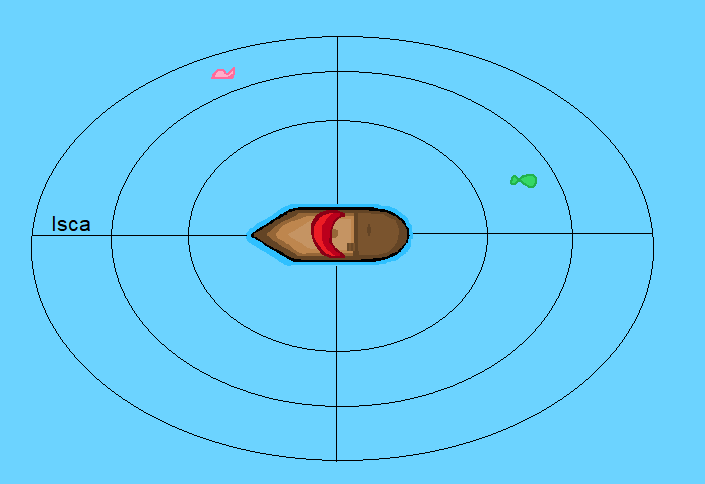
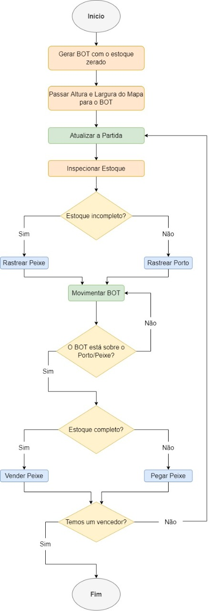

# Projeto Final da Disciplina de Introdução às Técnicas de Programação.

Desenvolvido por: Stefane de Assis e Débora Everly

## Introdução

O Projeto desenvolvido tem como objetivo a implementação de quatro BOTs
que funcionem como um barco-pesqueiro em um jogo de simulação que
acontece em uma área de pesca gerenciada pelo Órgão de Controle do Meio
Ambiente (OCMA). Esse projeto é baseado no jogo disponibilizado pelo André
Maurício em <https://github.com/amccampos/ocma>.

O jogo consiste em divulgar o avanço tecnológico aplicado nos barcos do
futuro, onde são barcos-pesqueiros inteligentes que atuam de forma a controlar
o impacto que acontece na exploração indiscriminada dos recursos naturais do
litoral nordestino. Para isso, esses barcos são capazes de pescar sem
intervenção humana, seguindo normas rígidas do controle ambiental e, caso
algum pescador inescrupuloso altere a programação do barco, sua própria
inteligência artificial denuncia suas irregularidades, onde o OCMA pode intervir
de forma mais rápida e assertiva.
Assim, diversos barcos são lançados em meio a uma área de pesca com
três espécies de peixe presentes: Robalo, Cioba e Tainha, cada um com um
preço de mercado diferente por seu quilo, além de haver uma limitação em que
o barco só pode pescar/transportar 10 quilos de peixe. Caso o pescador deseje
continuar pescando deve ir ao porto mais próximo vender sua carga, liberando
espaço desejado no barco e, assim, continuar a pesca. Caso contrário o
pescador deve pagar uma multa por cada quilo de peixe em excesso em seu
barco.
Por fim, entre os quatro BOTs, vence o barco que alcançar o saldo máximo
de R$ 10.000,00, ou tiver o maior saldo ao final de um número máximo de
rodadas. Além disso, mesmo que um barco esteja cheio de peixe quando o
jogo terminar, só contará para a classificação o saldo que o mesmo possui, que
é o saldo garantido na venda dos peixes no porto.
O intuito desta aplicação é, portanto, não somente programar um simples
barco de pesca, como também criar o melhor método e algoritmo capaz de
analisar e identificar as melhores ações para cada BOT, podendo metrificar
qual será a melhor performance e, principalmente, a estratégia mais inteligente
para ganhar o jogo. Partindo deste princípio, foi pensado então diversas
estratégias para alcançar tal objetivo.
Contudo, a estratégia abordada baseia-se nos seguintes questionamentos
seguidos de suas soluções abordadas no projeto.

1. Como o barco poderá enxergar todo o tabuleiro?

    Para solucionar essa questão foi preciso criar uma matriz bidimensional
onde cada posição x e y da matriz corresponde a uma posição no mapa.
Portanto, o BOT consegue enxergar o tabuleiro assim que o mesmo é gerado
guardando a suas informações.

2. Como o barco saberá onde estão os peixes e o porto?

    Foi desenvolvido um rastreador que funciona a partir do momento que é
gerado a matriz do mapa, assim, o BOT consegue mapear, até um limite
máximo, dentro do mapa onde estão os peixes e o porto, podendo
movimentar-se até o objetivo desejado. A imagem abaixo ilustra como funciona
esse rastreio, que tem como base um perímetro máximo, onde o rastreador
identifica todos os alvos e encontra o mais próximo.



3. Como chegaremos até os peixes e ao porto?

    A partir do momento que o BOT rastreia os objetos mais próximos (peixe
ou porto), o mesmo começa a movimentar-se com base na escolha de uma
direção (esquerda, direita, em cima ou em baixo), comparando se a direção
escolhida vai está mais próxima do alvo ou não, e assim, consegue
movimentar-se de posição em posição sempre analisando se a próxima
posição está mais perto do alvo.

4. Como o barco gerenciará a quantidade de peixes que recolhe?

    Para identificar se o barco está gerenciando corretamente a coleta de
peixes, no padrão das regras definidas, foi pensando em uma solução que
avisa ao pescador se o estoque está cheio. Assim, quando essa situação
ocorrer, deve-se procurar o porto mais próximo e vender todo o estoque de
peixes, podendo, em seguida, pescar mais peixes, sem gerar multas de quilos
excessivos no estoque.

## Implementação

Em relação a lógica das ações do BOT no algoritmo, ela é interpretada
de acordo com o fluxograma a seguir.



Como podemos ver, cada ação corresponde a uma função desenvolvida
para o BOT, e as mesmas serão explicadas a seguir.

Para o início, foi criado uma espécie de registro chamado BOT com os
campos definidos como: dadosBot (dados do BOT), x (posição do BOT em
relação ao eixo x do mapa), y (posição do BOT em relação ao eixo y do mapa)
e **Campo (ponteiro da matriz do mapa do jogo). Esse registro foi desenvolvido
para poder organizar os dados relacionados ao BOT e ao comportamento em
volta dele.

~~~c
typedef struct{
    int dadosBot;
    int x;
    int y;
    int **campo;
} Bot;
~~~~

Além disso, foi utilizado algumas variáveis globais para trazer informações
fixas e dinâmicas em qualquer lugar do arquivo.

Estoque: Recebe 0 ou 1 durante todo o jogo, sendo o 0 indicando
quando o estoque está cheio e o 1 quando ainda é viável colocar
mais peixe no estoque.

Peso: Gerencia a quantidade de quilo dos peixes que o barco
recolhe, sendo sempre supervisionado por funções futuras que
serão apresentados neste documento.

AlvoX e AlvoY: São as coordenadas que são marcadas para que o
barco tenha como objetivo. Elas podem ser modificadas de acordo
com as ações do BOT.

Height e Width: É a largura e o comprimento da matriz do jogo,
sendo geradas uma única vez por jogada. Eles são utilizados para o
BOT poder captar o tamanho do seu tabuleiro e, assim, evitar que o
ultrapasse as fronteiras.

Após isso, foram feitas algumas modificações na função readDate, para
que o Bot possa enxergar tudo que ocorre dentro do tabuleiro.

~~~c
void readData(int h, int w, Bot *bot) {
    char id[MAX_STR];
    int v, n, x, y;
    // lê os dados da área de pesca
    for (int i = 0; i < h; i++) {
        for (int j = 0; j < w; j++) {
            scanf("%i", &v); /*0 - mar, 1 - porto, 10 a 39*/
            bot->campo[i][j] = v;
        }
    }
    // lê os dados dos bots
    scanf(" BOTS %i", &n);
    bot->dadosBot = n; /* rescolhendo para variavel bot*/
    for (int i = 0; i < n; i++) {
        scanf("%s %i %i", id, &x, &y);
        if(strcmp(id, "magalhaes") == 0){ /* Quando for o botA*/
            fprintf(arquivo, "\n============ PARTIDA %s ===========\n", id);
            bot->x = x;
            bot->y = y;
        }   
    }
}
~~~

Como pode-se analisar foi colocado o parâmetro do tipo Bot para que
ele traga os campos do registros, como a variável **Campo, que é utilizado
dentro dos laços de repetição para captar os dados v de cada campo do
tabuleiro e armazená-los no registro, a fim de o BOT entender o que se passa
na matriz do jogo, e também, as variáveis x e y para marcar no registro onde o
BOT se encontra naquela matriz.

Após isso, é definido o responsável por escanear toda a matriz do
tabuleiro e entregar o peixe ou porto mais próximo ao BOT, para isso criou-se a
função rastrearPeixe e rastrearPorto, ambas com o mesmo objetivo,
porém com alvos diferentes.

~~~c
void rastrearPeixe(Bot bot){
    fprintf(arquivo, "Rastreando peixe \n");
    int isca = 20; //raio de 20
    int calculo; //calculo dinamico
    for(int i = 0; i < height; i++){ //escaneando toda a matriz...
        for(int j = 0; j < width; j++){
            if((bot.campo[i][j] % 10) > 1){ //peixes
                calculo = abs(bot.x - i) + abs(bot.y - j); //distancia do barco para os peixes
                if(calculo < 0){
                    calculo = calculo * (-1); /*Matar os negativos*/
                }
                if(calculo < isca){
                    isca = calculo; //Novo alvo mais próximo
                    alvoX = i; //registrar coordenada x do alvo
                    alvoY = j; //registrar coordenada y do alvo
                }
            }
        }
    }
}
void rastrearPorto(Bot bot){
    fprintf(arquivo, "Rastreando porto \n");
    int isca = 20; //raio de 20
    int calculo; //calculo dinamico
        for(int i = 0; i < height; i++){
            for(int j = 0; j < width; j++){
                if(bot.campo[i][j] == 1){
                    calculo = abs(bot.x - i) + abs(bot.y - j);
                }
                if(calculo < 0){
                    calculo = calculo * (-1); /*Matar os negativos*/
                }
                if(calculo < isca){
                    isca = calculo; //Novo alvo mais próximo
                    alvoX = i; //registrar coordenada x do alvo
                    alvoY = j; //registrar coordenada y do alvo
                }
            }       
        }
    fprintf(arquivo, "Coordenadas do alvo: %d %d || Distancia do alvo: %d \n",isca, alvoX, alvoY);
    }
~~~

Note que foi utilizado as variáveis locais isca e calculo. A isca é
utilizada para fixar um valor que pode ser alterado de acordo com a distância
do limite vetorial que o BOT queira encontrar dos pontos de pesca ou do porto.
Já o calculo, é o resultado final da distância vetorial entre um ponto de pesca
e o porto. Esse cálculo sempre passa por um loop que escaneia toda a matriz
e, assim, compara as distâncias entre os alvos mais distantes, de acordo com o
limite da isca, recolhendo aquela mais próxima ao BOT.

Além disso, para monitorar também os campos que são identificados
como peixes, a condição é válida seguindo a regra do cálculo:
```
if((bot.campo[i][j] % 10) > 1)
``` 
onde, de acordo com o valor no campo presente, seu módulo entra em um
intervalo de dez em dez, onde é identificada com os tipos de peixe e com sua
quantidade, sempre limitada até 1 para que o barco identifique que aquele
ponto de pesca tem somente um peixe e assim não o valide mais como um
alvo.

Para realizar a coleta de peixes, foi feita uma função com uma estrutura
básica para utilizar o comando FISH com o objetivo de pegar o peixe e logo em
seguida atribuir os seus quilos a variável peso, onde essa variável vai
incrementando a quantidade em quilos de cada peixe pescado pelo barco.

~~~c
void pegarPeixe(){
    printf("FISH\n");
    fprintf(arquivo, "Pescando peixe \n");
    peso = peso + 1;
}
~~~

Após a coleta de peixes, chega o momento que o estoque chega ao seu
limite máximo e é preciso vender os peixes. Assim, como a função anterior, a
função venderPeixe também segue uma estrutura básica de vender peixes
com o comando SELL, após isso, como o comando vende todos os peixes de
uma vez a variável peso é zerada para que possa repor futuramente mais
peixes pescados.

~~~c
void venderPeixe(){
    printf("SELL\n");
    fprintf(arquivo, "Vendendo peixe \n");
    peso = 0;
}
~~~

Para não pagar multa por excesso de quilo de peixes, é sempre
importante verificar o estoque para saber se cabe mais peixes ou não, assim, a
função inspecionarEstoque tem como finalidade escanear a cada partida a
situação atual da quantidade de peixes no BOT. Após isso, ela atualiza a
situação atual do estoque, sendo :

0 - o barquinho está cheio
1 - o barquinho ainda pode pegar peixes

~~~c
void inspecionarEstoque(){
    fprintf(arquivo, "Estoque: %d kg \n", peso);
    // CARGA MÁXIMA: 10
    if(peso < 10){
        estoque = 1;
    } else{
        estoque = 0;
    }
}
~~~

Como podemos ver, com essa função o algoritmo pode seguir com o
próximo passo que é escolher se o BOT ainda vai rastrear o peixe ou vai
rastrear o porto, dependendo da situação do seu estoque.

Em seguida, entra-se na função que é a última a dar comando ao BOT
quando ele já estiver em cima do alvo.

~~~c
void escolherAcao(){
    if(estoque == 1){
        pegarPeixe();
    } else{
    venderPeixe();
    }
}
~~~

Percebe-se que a função escolherAcao tem uma estrutura bem
simples pois ela complementa a última tarefa que o BOT irá fazer após se
movimentar para o alvo.

Contudo, para o movimento do BOT segue uma regra de inicialmente
começar pela esquerda, obedecendo esse princípio de forma encadeada,
onde, dependendo da distância vetorial entre o BOT e o alvo, ele decide se
deve ir para a esquerda, senão, para a direita até chegar a mesma posição
horizontal do alvo. Após isso, ele segue de forma vertical, assim, quando o
BOT identificar que está sobre o alvo inicia-se o processo de escolher a
próxima ação, que pode ser pegar ou vender peixe como apresentado nas
funções anteriores.

~~~c
void movimentar(Bot bot){
    if(bot.y > alvoY){
        fprintf(arquivo, "Direção: Esquerda \n");
        printf("LEFT\n");
    } else if(bot.y < alvoY){
        fprintf(arquivo, "Direção: Direita \n");
        printf("RIGHT\n");
    } else{//Se são iguais
        if(bot.x > alvoX){
            fprintf(arquivo, "Direção: Cima \n");
            printf("UP\n");
        } else if(bot.x < alvoX){
            fprintf(arquivo, "Direção: Baixo \n");
            printf("DOWN\n");
        } else{
            fprintf(arquivo, "Direção: Estamos em cima do alvo!! \n");
            escolherAcao(); //Vai pescar ou vender? isso dependerá de seu estoque
        }
    }
}
~~~

Com essas sete funções foi possível criar a seguinte organização
dentro da função main, onde, primeiramente o BOT inspeciona seu estoque, e
com isso ele decide entre rastrear um cardume de peixes ou um porto, após
isso, ele se movimenta até o alvo marcado e depois ele pega ou, se o estoque
cheio, ele vende o peixe.

~~~c
while (1) {
    readData(h, w, &bot); /*Atualiza o registro*/
    inspecionarEstoque();
    fprintf(arquivo, "====================================\n");
    fprintf(arquivo, "Coordenadas do barco: X: %d Y: %d\n", bot.x, bot.y);
    fprintf(arquivo, "Coordenadas do Alvo: X: %d Y: %d\n", alvoX, alvoY);

    switch (estoque){
        case 1:
            rastrearPeixe(bot);
        break;
        case 0:
            rastrearPorto(bot);
        break;
        }
        movimentar(bot);
        scanf("%s", line);
        fprintf(arquivo,"Tamanho do mar: %d x %d\n", width, height);
}
~~~

Por fim, também é aberto um arquivo .txt onde armazena-se as ações
por partida dos quatro BOTs, assim, é possível registrar e salvar as ações de
cada BOT em cada jogada.

## Anexo (Código-Fonte)

Para executar o jogo, é preciso executar os comandos abaixo no console
dentro da pasta que contém os arquivos do jogo. Os quatros primeiros
comandos são para compilar os algoritmos de cada BOT e o último para rodar
o jogo com os quatro BOTs compilados.

~~~c
gcc -o magalhaes magalhaes.c
gcc -o rubidea rubidea.c
gcc -o palida palida.c
gcc -o mimosa mimosa.c
node ocma magalhaes mimosa palida rubidea
~~~

Em seguida, o jogo terá seu comportamento automatizado até obter um
ganhador, ao final, mostra-se o ranking dos BOTs, onde em primeiro é o
vencedor. Para acompanhar melhor cada partida, o jogo produz um log.